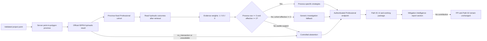

# ARCUS Mitigation Intelligence v1 — End-to-end validation

## Validation judgement

**`validated_with_limitations`**

The hydraulic vertical slice is deterministic, abstains under the defined conditions, preserves the server-derived territorial cohort, does not leak into the Final Priority Index or Path 02, and is coherently connected to the authenticated Professional endpoint, Path 01 UI and report. Readiness is limited by uneven provincial evidence coverage and by the fact that the deterministic harness replays locked results from documented live ISPRA checks rather than depending on the availability of the remote provider on every run.

No probability, safe/unsafe classification, normalized mitigation score or automatic design prescription is produced.

## v2 national analogue foundation

The implementation now includes the `arcus-mitigation-intelligence-v2`
retrieval foundation documented in
`ARCUS_MITIGATION_INTELLIGENCE_V2.md`. It compares the project point with
documented collapses across Italy using current official hazard signatures,
with no province filter and no collapse outcome field used during selection.
Trigger, failure process and affected component are read only after the cohort
is fixed.

The production gate requires at least 80% current official hydraulic-signature
coverage and at least three eligible analogues. The current registry contains
263 dry-run placeholders and zero completed official signatures, so the gate is
closed and the UI/report explicitly use the controlled point-derived provincial
fallback. This prevents a partially enriched national sample from creating
selection bias.

The historical-at-event registry is deliberately empty. The current official
class is never assigned to the year of collapse; a historical class is accepted
only from an authenticated dated source. This limits retrospective
interpretation but does not block present-day current-signature retrieval.

Unit fixtures verify national cross-province retrieval, deterministic ranking,
the absence of geography filters, `outcome_fields_used_for_selection: []`,
post-retrieval outcome reading and the non-reconstruction of missing historical
classes. Live population of the current-signature registry remains pending
explicit authorisation to send the 263 collapse coordinates to the official
ISPRA and INGV services. The overall judgement remains
`validated_with_limitations`.

## Reproducible command

```powershell
npm run validate:mitigation-intelligence
```

The machine-readable output includes, for every case, coordinates, client and server-derived province, ISPRA status/classes/highest class, raw cohort and event IDs, weighted evidence, evidence-level and process-strength distributions, qualified processes, strategies, abstention reasons, linked source records, limitations and `external_validation_required`.

## End-to-end flow



## Validation cases

The P1, P2, P3 and Torino `no_intersection` rows replay exact coordinates and signatures previously observed against the live ISPRA WFS and documented in `PROFESSIONAL_HYDRAULIC_EXPOSURE_VALIDATION.md`. The other rows use a controlled `available` exposure fixture to isolate territorial and threshold behaviour; they are not represented as new live ISPRA observations.

| Case | Coordinates | Province | ISPRA result | Raw evidence | Effective evidence | Strategies | Status | Result |
|---|---|---|---|---:|---:|---|---|---|
| Real ISPRA P1 replay | `38.94973151, 8.72300141` | Sud Sardegna (client: Cagliari, corrected) | `available`; P1; highest P1 | 0 | 0 | none | `abstained` | PASS — insufficient provincial evidence |
| Real ISPRA P2 replay | `38.94340710, 8.91222919` | Cagliari | `available`; P1/P2; highest P2 | 3 | 2.5 | generic hydraulic investigation | `limited_evidence` | PASS |
| Real ISPRA P3 replay | `37.67112259, 12.58006927` | Trapani (client: Palermo, corrected) | `available`; P1/P2/P3; highest P3 | 2 | 1.5 | none | `abstained` | PASS — below effective threshold |
| Real ISPRA no-intersection replay | `45.28970000, 7.94194000` | Torino | `no_intersection`; no class | 40 | 26 | none | `abstained` | PASS — abundant history cannot override no-intersection |
| Abundant hydraulic evidence | `45.07030000, 7.68690000` | Torino | controlled `available`; P1/P2; highest P2 | 40 | 26 | bank/embankment, scour, overtopping/hydrodynamic | `available` | PASS |
| Limited hydraulic evidence | `44.10250000, 9.82410000` | La Spezia | controlled `available`; P1/P2; highest P2 | 4 | 4 | generic hydraulic investigation | `limited_evidence` | PASS — no process individually qualifies |
| Insufficient hydraulic evidence | `44.91290000, 8.61520000` | Alessandria | controlled `available`; P1/P2; highest P2 | 2 | 1.5 | none | `abstained` | PASS |
| Outside Italy | `48.85660000, 2.35220000` | none | controlled fixture ignored after location failure | 0 | 0 | none | `abstained` | PASS — `point_outside_italy` |
| Province not associable | `41.90000000, 12.50000000` | none | controlled fixture ignored after resolver failure | 0 | 0 | none | `abstained` | PASS — `province_not_resolved` |
| Invalid coordinates | `not-a-coordinate, 12.50000000` | none | controlled fixture ignored after validation failure | 0 | 0 | none | `abstained` | PASS — `invalid_coordinates` |
| Territorial mismatch | `43.61580000, 13.51890000` | Ancona (client: Torino, corrected) | controlled `available`; P1/P2; highest P2 | 8 | 7.5 | bank/embankment, scour | `available` | PASS — client province ignored |

## Evidence details

| Case | Evidence-level distribution | Qualified processes | Event IDs | Linked sources |
|---|---|---|---|---:|
| P1 | none | none | none | 0 |
| P2 | documented 2; probable 1 | none | `B08.10.01`, `B18.10.01`, `B18.10.02` | 9 |
| P3 | documented 1; probable 1 | none | `B18.02.02`, `B21.12.01` | 5 |
| Torino no-intersection / abundant | documented 23; probable 6; needs_review 3; unspecified 8 | bank/embankment; scour; overtopping/hydrodynamic | 40 sorted IDs, from `B00.10.03` through `B24.09.01`; full list in harness output | 119 |
| La Spezia limited | documented 4 | none | `B11.10.01`, `B11.10.05`, `B11.10.06`, `B11.10.07` | 8 |
| Alessandria insufficient | documented 1; probable 1 | none | `B02.11.01`, `B19.10.01` | 6 |
| Invalid/outside/unresolved | none | none | none | 0 |
| Ancona mismatch | documented 7; probable 1 | bank/embankment; scour | `B11.01.01`, `B22.09.01`, `B22.09.02`, `B22.09.03`, `B22.09.06`, `B22.09.07`, `B22.09.09`, `B22.09.10` | 23 |

Every emitted strategy has `external_validation_required: true`. Abstained cases emit no strategy, so the strategy-level field is not applicable. Complete source IDs, titles, types and URLs are emitted by the deterministic harness.

## Threshold matrix

| Decision | Raw evidence | Effective evidence | Output |
|---|---:|---:|---|
| Moderate process strength | `>= 8` | `>= 5` | `moderate` evidence label |
| Qualified process | `>= 3` | `>= 2` | process-specific strategy if the process exists in the hydraulic catalogue |
| Usable cohort, no qualified process | any | `>= 2` | one generic investigation fallback; `limited_evidence` |
| Insufficient cohort | any | `< 2` | no strategy; `abstained` |
| Official `no_intersection` | any | any | no strategy; `abstained` |
| Invalid/unresolved location | any | any | no strategy; `abstained` |

Evidence weights are fixed and verified as `documented = 1`, `probable = 0.5`, `needs_review = 0`. Other/unspecified evidence also contributes zero. A process below either process threshold cannot emit a process-specific strategy.

## Invariants and anti-leakage checks

- The server-derived point-in-polygon province is the sole territorial source of truth. A client mismatch is retained for traceability but cannot choose the cohort.
- Province filtering fixes the cohort before `failure_process`, `component_involved` and `evidence_level` are read.
- Reversing event input order yields an identical response after excluding `generated_at` and `request_id`; event IDs are sorted deterministically.
- Repeating the same request yields identical substantive output after excluding the same volatile fields.
- A strong provincial cohort with official `no_intersection` emits no hazard-specific or generic strategy.
- Exact threshold, below-effective-threshold, needs-review-zero, raw-threshold and generic-fallback fixtures pass.
- Static integration checks confirm that the endpoint synchronizes the server location before building the cohort, requires `professional:read`, and the client sends the CSRF token.
- `analytics.js`, the Path 02 report block and asset screening do not consume Mitigation Intelligence or `hydraulic_intelligence`. The service explicitly forbids FPI modification.
- The Path 01 UI exposes status, weighted evidence and strategies; the Path 01 report contains a separate Mitigation Intelligence section and the non-prescriptive/FPI warning.

## Abstention and unavailable behaviour

Controlled abstention occurs for an invalid or unresolved project point, official hydraulic `no_intersection`, provider results that do not activate the hydraulic track, or effective evidence below 2. `unavailable` is a UI transport/service state used when the endpoint cannot be reached or official exposure retrieval fails; it does not generate strategies.

## Scientific limits and territorial coverage

- The implementation is hydraulic-only. Landslide and seismic tracks remain contextual and cannot emit v1 mitigation strategies.
- Provincial cohorts are materially uneven: the validated cases range from 0 hydraulic events in Sud Sardegna to 40 in Torino.
- Administrative geography matters: the real P1 point resolves to Sud Sardegna, while related historical records may be classified under Cagliari. The correct response is abstention, not cross-province borrowing.
- Historical analogues are contextual evidence, not site probability, current-condition evidence or proof of structural safety.
- ISPRA point exposure and ARCUS historical evidence remain separate evidence families; they are not fused into a normalized score.
- Remote provider availability, dataset currency, administrative-boundary changes and incomplete historical outcome curation remain external limitations.

## UI and report coherence

The source-level chain is complete:

1. Project Location derives the province from the validated point.
2. Official Geospatial Exposure supplies the ISPRA hydraulic status/classes.
3. Provincial Historical Context remains a separately displayed evidence family.
4. Mitigation Intelligence consumes the official result and the fixed provincial cohort.
5. The working package uses emitted strategies only for Path 01; abstention produces an explicit no-automatic-strategy statement.
6. The report repeats the status, raw/effective evidence summary, strategies and non-prescriptive/FPI warning.

### Manual browser run

The local browser run confirmed:

- Professional authentication and entry into `01 / New territory`;
- coordinate entry for the documented P2 point `38.94340710, 8.91222919`;
- point-derived province `Cagliari`, three Professional events in scope and the same territory/project point in the working package;
- separate Project Location, Official Geospatial Exposure and Provincial Historical Context cards;
- `Normalized score: not assigned` in the official hydraulic card;
- report generation unlocked only after the project point was validated.

The run did **not** complete the requested visual comparison of `available`, `limited_evidence` and `no_intersection/abstained`. The remote ISPRA calls returned `service_unreachable` in the browser environment. After restarting the backend outside the network sandbox, the browser security policy blocked the reload required to renew the session/CSRF state. No workaround was used. Those three render paths are therefore covered by deterministic service cases and static UI/report coherence assertions, but not claimed as fully manually observed in this run.

## Warnings and readiness

- Do not interpret `available` as safe, unsafe, probable failure or design approval.
- Do not interpret `abstained` as absence of hazard or absence of required engineering investigation.
- Do not use a controlled exposure fixture as evidence that ISPRA intersects that test coordinate.
- Do not extend these validated conclusions to landslide, seismic or Path 02.

The vertical slice is ready for controlled Professional Path 01 use with the existing warnings and external expert review requirement. It is not ready for autonomous mitigation decisions, national completeness claims, site safety conclusions or extension to other hazard tracks.

The manual UI acceptance item remains open for a browser session with working ISPRA connectivity. This is the principal reason for the `validated_with_limitations` rather than unqualified `validated` judgement.

## Final manual UI acceptance

Manual execution date: 2026-07-22. Backend and Vite frontend were run locally and the Professional Path 01 workflow was exercised through the browser without fixtures or mocks. The ISPRA observations below are the statuses actually returned by the live WFS-backed endpoint.

| Case | Coordinates | Province | ISPRA | Mitigation status | Strategies | UI coherent | Report coherent | Result |
|---|---|---|---|---|---|---|---|---|
| `available` | `45.31310000, 7.28870000` | Torino (point-derived; working package synchronized) | `partial`; P3 `available`, P1/P2 `request_timeout`; matched/highest class P3 | `available`; raw 40, effective 26 | 3 qualified process-specific strategies only: bank/embankment, scour, overtopping/hydrodynamic action | Yes, with the recorded ISPRA partial-response limitation | Yes after the report-only fix below; status, raw/effective evidence, three strategies and non-prescriptive/FPI warning are present | PASS with ISPRA limitation |
| `limited_evidence` | `38.94340710, 8.91222919` | Cagliari (point-derived; working package synchronized) | `available`; P1/P2 `available`, P3 `no_intersection`; matched classes P1/P2, highest P2 | `limited_evidence`; raw 3, effective 2.5 | One generic fallback only: site-specific hydraulic and geomorphological investigation | Yes | Yes after the report-only fix below; `limited_evidence`, raw 3, effective 2.5, generic fallback and non-prescriptive/FPI warning are present | PASS |
| `no_intersection / abstained` | `45.28970000, 7.94194000` | Torino (point-derived; working package synchronized) | `partial`; P1/P2 `request_timeout`, P3 `no_intersection`; no matched/highest class. A prior attempt returned `request_timeout` on all three layers and later attempts reached the backend circuit-breaker `service_unreachable` state | `abstained`; zero strategies; the UI explicitly states that ARCUS abstains | None | Yes for conservative abstention and zero strategies; the requested complete live `no_intersection` state was not obtained | Not accepted as the requested live report case because official P1/P2 evaluation did not complete | BLOCKED by ISPRA timeouts |

### Recorded evidence

- `available`: [UI strategy panel](assets/mitigation-intelligence-validation/available-candidate-partial-ispralive.png), [full live exposure view](assets/mitigation-intelligence-validation/available-candidate-partial-ispralive-full.png), [report page 4](assets/mitigation-intelligence-validation/available-report-page-4.png).
- `limited_evidence`: [UI fallback panel](assets/mitigation-intelligence-validation/p2-limited-evidence.png), [full live exposure view](assets/mitigation-intelligence-validation/p2-official-exposure-full.png), [report page 4](assets/mitigation-intelligence-validation/p2-report-corrected-page-4.png).
- Torino requested control: [abstention panel under partial ISPRA response](assets/mitigation-intelligence-validation/torino-abstained-partial-ispralive.png), [full partial exposure view](assets/mitigation-intelligence-validation/torino-official-exposure-partial-full.png).

The clean post-restart browser session recorded no console errors. The Professional hazard endpoint returned normally to the browser for the passing cases. The failed network observations were provider-layer failures reported in the payload: repeated P1/P2 `request_timeout` responses for Torino/Ancona candidates and the subsequent circuit-breaker `service_unreachable` state. Direct ISPRA WFS `GetCapabilities` returned HTTP 200 during the run, so the limitation is intermittent/operation-specific rather than a total DNS or host outage.

No screen showed collapse probability, safe/unsafe classification, automatic prescription or a normalized Mitigation Intelligence score. Official exposure continued to show `Normalized score: not assigned`, separate from Mitigation Intelligence. Both passing UI cases and their reports state that strategies do not modify the Final Priority Index and require qualified professional validation.

### Blocking report bug and minimal correction

The first PDF generated from the live Cagliari case reproduced a report-only omission: the Actions page included the fallback text but omitted the Mitigation Intelligence status, raw/effective evidence and the explicit non-prescriptive/FPI warning. The minimum correction adds a presentation-only Mitigation Intelligence summary to the Path 01 structured PDF. It does not change the service, datasets, evidence weights, thresholds, strategy selection or Final Priority Index. A pure formatter is covered for `limited_evidence` and `abstained`, and both the corrected Cagliari and Torino PDFs were extracted and rendered for visual inspection without clipping or overlap.

### Final manual judgement

The final manual acceptance is **not complete** because the required Torino control never returned a complete live `no_intersection` response across P1/P2/P3. The `limited_evidence` path is fully accepted, and an `available` Mitigation Intelligence path was observed with a live P3 intersection, but with partial ISPRA layer completion. The overall judgement therefore remains `validated_with_limitations`.
